#第一个Swift项目 Hello World

Swift是一门开源的编程语言，该语言用于开发OS X和iOS应用程序。

在正式开发应用程序前，我们需要搭建Swift开发环境，以便更好友好的使用各种开发工具和语言进行快速应用开发。由于Swift开发环境需要在OS X系统中运行，因此其环境的搭建将不同于Windows环境，下面就一起来学习一下swift开发环境的搭建方法。

成功搭建swift开发环境的前题：

1. 必须拥有一台苹果电脑。因为集成开发环境XCode只能运行在OS X系统上。
2. 电脑系统必须在OS 10.9.3及以上。
3. 电脑必须安装Xcode集成开发环境。

### Swift 开发工具Xcode下载

**Swift 开发工具官网地址：**[https://developer.apple.com/xcode/download/](https://developer.apple.com/xcode/download/)。

**Swift 源代码下载：**[https://swift.org/download/#latest-development-snapshots](https://swift.org/download/#latest-development-snapshots)

下载完成后，双击下载的 dmg 文件安装，安装完成后我们将 Xcode 图标踢移动到应用文件夹。

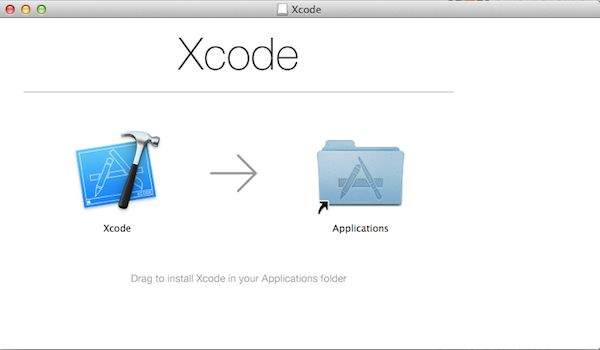

你也可以在 App Store 中搜索 xcode 安装，如下图所示：

* * *

## 第一个 Swift 程序

Xcode 安装完成后，我们就可以开始编写 Swift 代码了。

接下来我们在应用文件夹打开 Xcode，打开后在屏幕顶部选择 File => New => Playground。

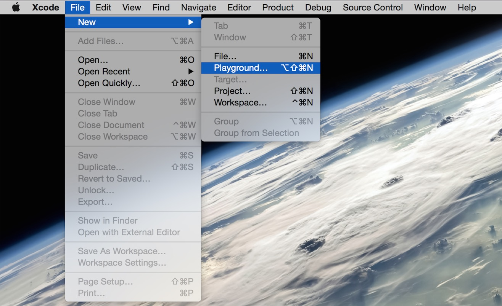

接着 为 playground 设置一个名字并选择 iOS 平台。

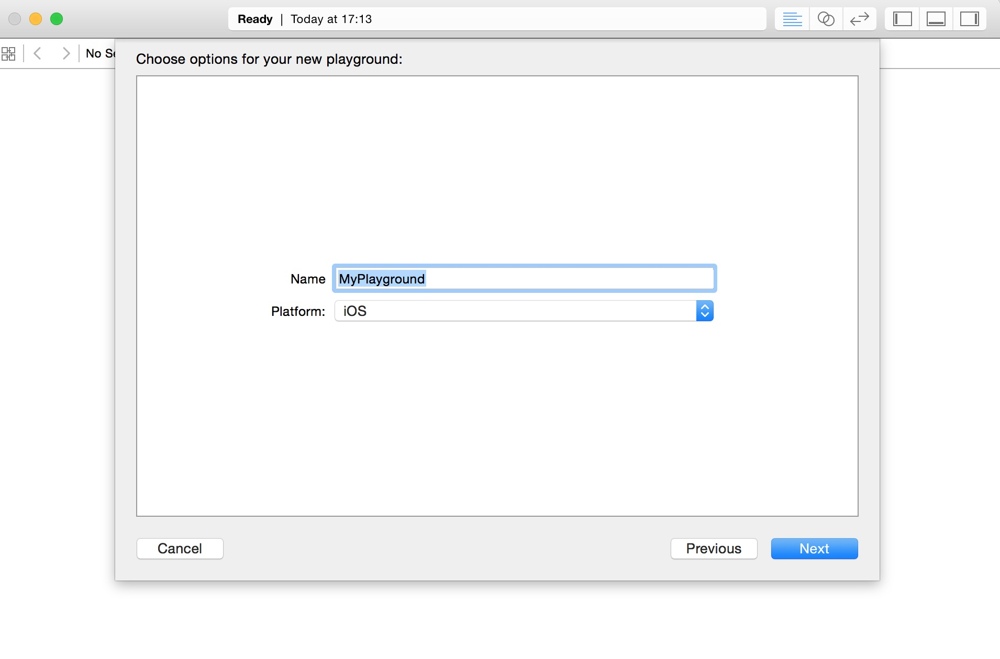

Swift 的 playground 就像是一个可交互的文档，它是用来练手学swift的，写一句代码出一行结果（右侧），可以实时查看代码结果，是学习swift语言的利器！ 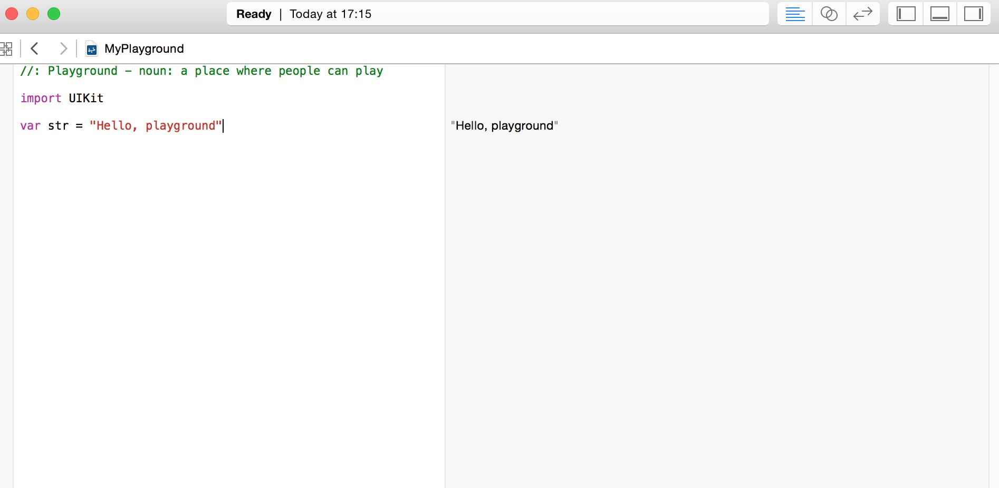

以下是 Swift Playground 窗口默认的代码：

import  UIKit  var str =  "Hello, playground"

如果你想创建 OS x 程序，需要导入 Cocoa 包 **import Cocoa** 代码如下所示：

import  Cocoa  var str =  "Hello, playground"

以上程序载入后，会在Playground 窗口右侧显示程序执行结果：

Hello, playground

至此，你已经完成了第一个 Swift 程序的学习，恭喜你入门了。

* * *

## 创建第一个项目

1、打开 xcode 工具，选择 File => New => Project

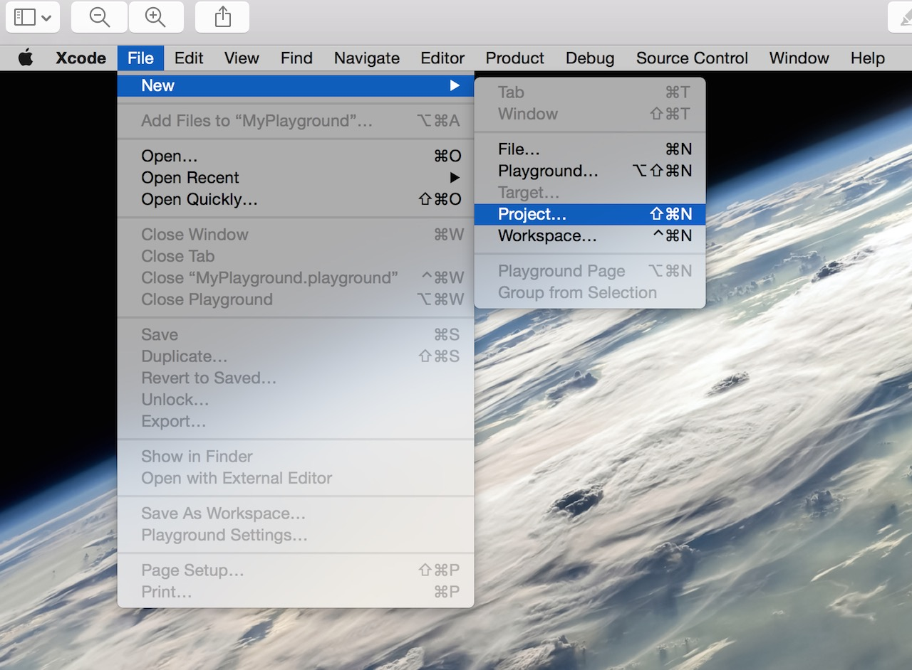

2、我们选择一个"Single View Application"，并点击"next"，创建一个简单示例app应用。

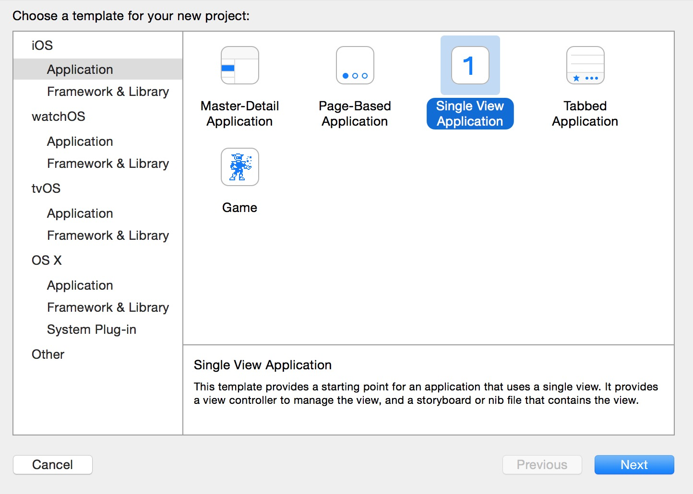

3、接着我们输入项目名称（ProductName),公司名称（Organization Name),公司标识前缀名（Organization identifier) 还要选择开发语言(Language),选择设备（Devices)。

其中Language有两个选项：Objective-c和swift，因为我们是学习swift当然选择swift项了。 点击"Next"下一步。

4、选择存放的目录，如果要使用Git源代码管理，将勾上Source Control的create git repository on My Mac. 点击create创建项目。

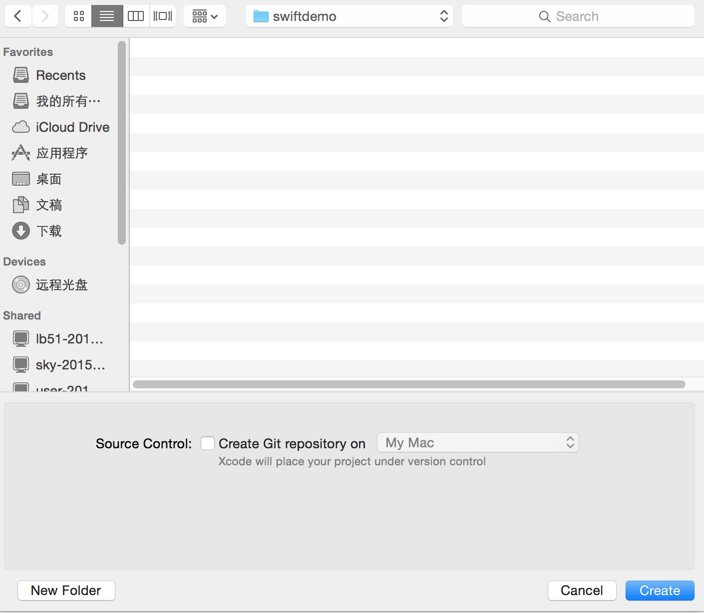

5、项目创建后，默认生成了一个示例文件，可以看到swift将oc中的h和m文件合并成了一个文件（即swift后缀名文件). Main.storyboard相当于xib文件，有比xib更多的功能。

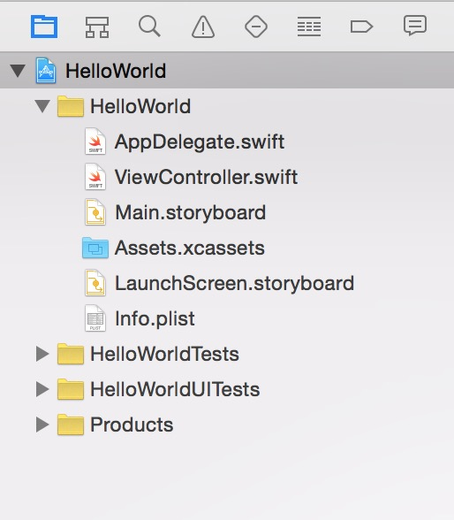

6、打开main.storyboard,默认看到一个简单的空白的应用界面，大小为平板界面大小。 如果开发都只需要开发兼容iphone手机的app,那么可以把Use Auto Layout的勾去掉（默认为勾上）。

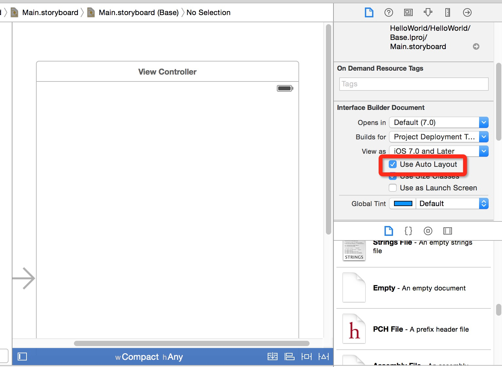

7、弹出了一个对话框，让我们选择界面尺寸，iPhone或都 iPad。我们选择iPhone的尺寸。

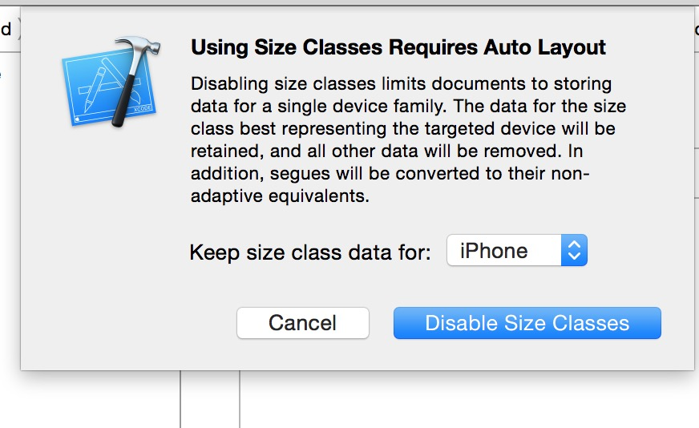

8、可以看到，界面大小变为了手机iphone的宽度和高度。

大家可以记住界面相关的尺寸，方便以后布局计算位置：

iPhone或iTouch的宽为320像素，高为480像素，状态栏高为20像素，toobar高为44像素，tabbar高为49像素，导航栏高为44像素。

9.我们为界面添加点内容，在右下方找到Text控件，将它拖入storyboard上，并双击写入文本"Hello World!"。

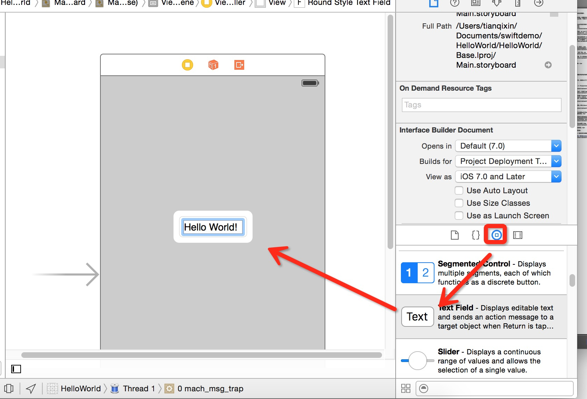

运行一下模拟器（command+R 快捷键或在菜单栏中选择 Product => Run)。

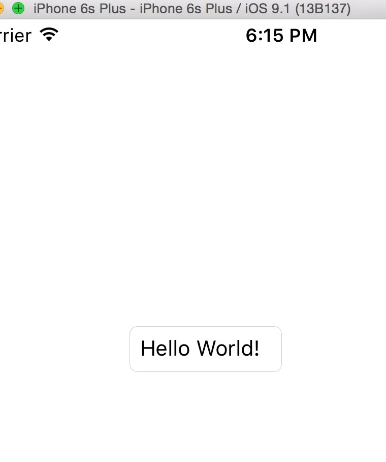

至此，我们的第一个Swift项目就完成了。

