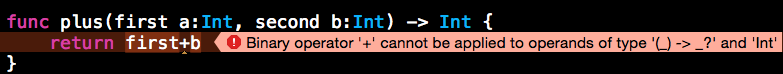
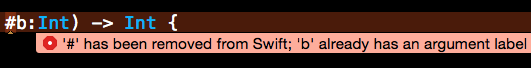

#函数定义与调用
### 函数声明

首先回顾oc中一个函数的声明

```
- (NSInteger)sum:(NSInteger)intA with:(NSInteger)intB;
```

以上声明，表示一个求和方法，根据参数intA和intB来求加和。
同样的声明，用swift语言怎么写呢？

```
func sum(intA : Int, with intB : Int) -> Int
```

对比一下这两个写法，swift把返回值放在了最后面，函数名也只有一段，相对简化了一些函数声明。

### 函数调用

接下来，函数的调用。首先还是oc的函数调用

```
[self sum:10 with:15];
```

swift的写法呢

```
sum(10 with:15)
```

可以看出来，无论是函数的声明还是调用，swift的写法都更加简洁，而且隐隐能看到c语言的痕迹。

### 函数的参数

一个函数，可以有参数也可以没有，关于参数，有哪些需要注意的地方呢？

#### a.参数的外部名

```
//还是上面的例子
func sum(intA : Int, with intB : Int) -> Int
```

首先大家注意到，参数intA和intB之间，我加了一个with。这个with是参数的外部名，相当于一个辅助描述，使参数调用更容易理解。如果不加描述，也是可以的

```
func sum(intA : Int, intB : Int) -> Int
```

这个时候，调用函数就有所区别了

```
sum(10 b:15)
```

注意到没有，第一个参数名是缺省的，而第二个参数要么写外部名，要么写参数名，不能缺省

> By default, the first parameter omits its external name, and the second and subsequent parameters use their local name as their external name. All parameters must have unique local names. Although it’s possible for multiple parameters to have the same external name, unique external names help make your code more readable.

官方文档也说的很清楚了，如果没有外部名，第一个参数会缺省参数名。

那么第一个参数能否可以加外部名呢？当然可以：

```
func sum(first intA : Int, second intB : Int) -> Int
```

调用函数时，一定要加外部名：

```
sum(first:10, second:15)
```

也就是swift为了代码可读性，要求参数之间要有一些外部名或者参数名。

**网上有人称之为内外参数，我认为是理解有误区的**，我们可以尝试调用描述，编译器报错如下：



描述符不等同于参数


仔细读一下报错

```
binary operator '+' cannot be applied to operands of type '(_)->_?' and 'Int'
```

描述部分的类型是什么？是`(_)->_?`，这根本不是我们定义的Int参数类型。

在早期的swift版本中，由于参数名可以缺省，当我们想定义描述，又觉得麻烦时，可以让描述和参数名共用，写法是`fun sum(#intA : Int, #intB : Int) -> Int，#用来表示共用`。**注意，这种写法已经被抛弃**



已经被抛弃的写法


swift还支持把外部名和参数名都省略，用 _ 来标示，即可

```
//声明
func sum(intA : Int, _ intB : Int) -> Int
//调用
sum(1, 2)
```

#### b.默认参数

回忆一下C的构造函数，就是可以有默认参数的。而swift的默认参数也是类似用法

```
//首先定义默认参数
func sum(intA : Int, intB : Int = 100) -> Int

//默认参数的位置可以缺省
sum(200)
```

也就是说，如果有默认参数，调用时可以省略这个参数。

我们还知道，C的构造函数中，默认参数必须在参数列表最末尾。但是swift中，默认参数可以在任意位置

```
//默认参数定义在首位
func sum(intA : Int = 100, intB : Int) -> Int

//缺省默认参数
sum(200)
```

记住，swift会自动匹配合适的参数个数，只要有符合的参数列表即可。

#### c.参数的常量和变量特性

这个比较简单，`swift函数的参数默认为常量属性，不允许修改`。也就是默认为 let 声明方式，如果参数要可以修改，使用 var 进行声明即可。

```
func sum(let intA : Int = 100, let intB : Int) -> Int  //常量，不允许修改
func sum(var intA : Int = 100, var intB : Int) -> Int  //变量
```

#### d.引用参数

在C函数中，就开始有引用的概念，传入一个变量的引用，就可以在函数中对外部变量进行修改。
同样，swift函数也支持引用参数，使用 `inout` 关键字进行声明：

```
//引用参数声明
func sum(inout intA : Int, intB : Int = 100) -> Int

//调用函数时，传入参数的引用
varA = 100, varB = 200
sum(&varA, varB)
```

#### e.变参列表

其实变参大家经常用到，比如 printf("") 就是变参，你传入多少参数，用相应占位符来标示。
oc中也有变参列表，用 ... 来标示，函数中使用 va_list 来遍历获取参数。

在swift中沿用了 ... 的变参列表形式，代码举例：

```
func sum(numbers : Int...) -> Int {
    var total = 0
    //这里获取变参更加的简单，只需遍历即可
    for i in numbers {
        total += i
    }
    return total
}

//调用函数
sum(100, 300, 20)
```

**注意**

1. 变参一定要在参数列表末尾
2. 一个函数中，只能声明一个变参


### 函数返回值

函数可以没有返回值，也可以有多个返回值，多个返回值使用元组返回。
对元组不了解的可以看帖子[元组实战](http://www.jianshu.com/p/15262607659c)

```
//使用元组，定义多个返回值
func testFunc() -> (Int, String) {
  return (100, "满分")
}
```

### 函数类型

也许你想传递一个函数作为参数，那么怎么声明一个函数类型的变量呢？

首先看一个函数声明，

```
func testFunc(var1 : Int, var2 : Int) -> Int
```

把里面涉及到类型的部分抽离出来，按顺序是

```
(Int, Int) -> Int
```

其实这就是函数类型。简直太他么简单了，相比C语言操蛋的写法，简直容易到泪奔~

尝试定义一个函数变量，非常简单

```
var varFunc : (Int, Int) -> Int
varFunc = function
```

甚至我们可以直接赋值，省略类型声明

```
var varFunc = function
```

卧槽，你说够不够简单！

函数类型同样可以用于函数的参数、返回值。来个例子：

```
//定义一个输出函数
func myprint(strs:String...) {
    for str in strs {
        print(str)
    }

}

//再定义一个函数，其参数是函数类型
func userOtherFunc(otherFunc : (String...)->Void) {
    otherFunc("呵呵呵呵", "就是任性")
}

//调用
userOtherFunc(myprint)
```

是不是足够简单？

再来个例子，函数类型的返回值：

```
func stepForward(input: Int) -> Int {
  return input + 1
}

func stepBackward(input: Int) -> Int {
  return input - 1
}

func chooseStepFunction(backwards: Bool) -> (Int) -> Int {
  return backwards ? stepBackward : stepForward
}

//调用
chooseStepFunction(true)
```

看完函数的使用，有没有觉得简单，简单，还是简单！所以说，学习一段时间swift后，我觉得它必火啊！


