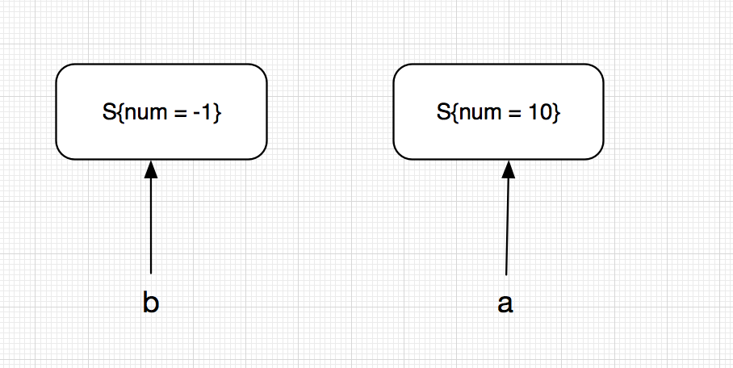
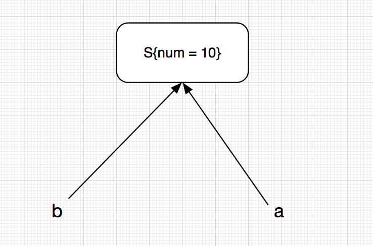
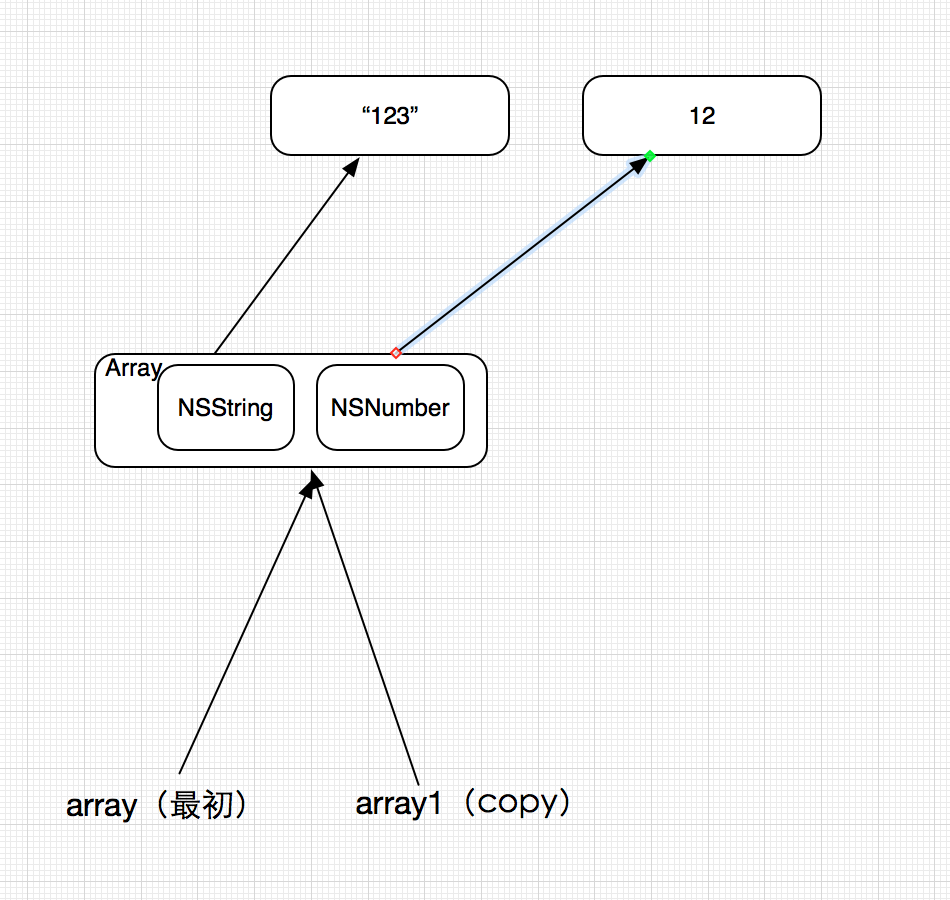
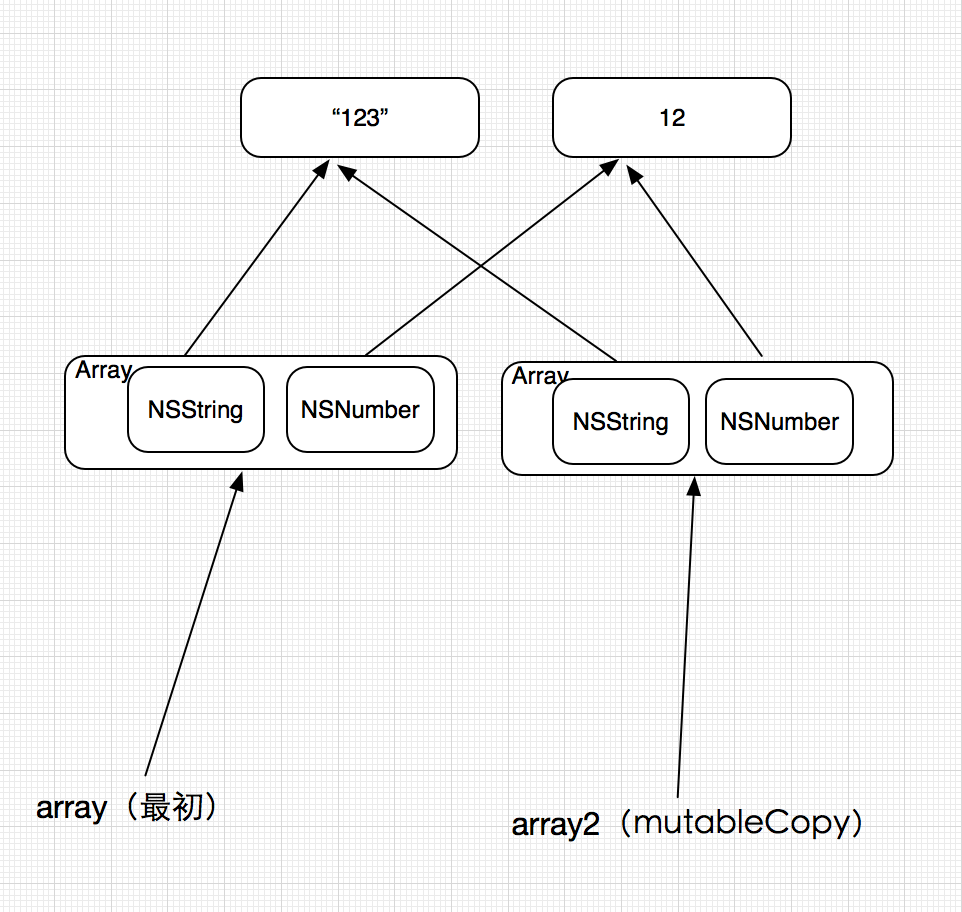
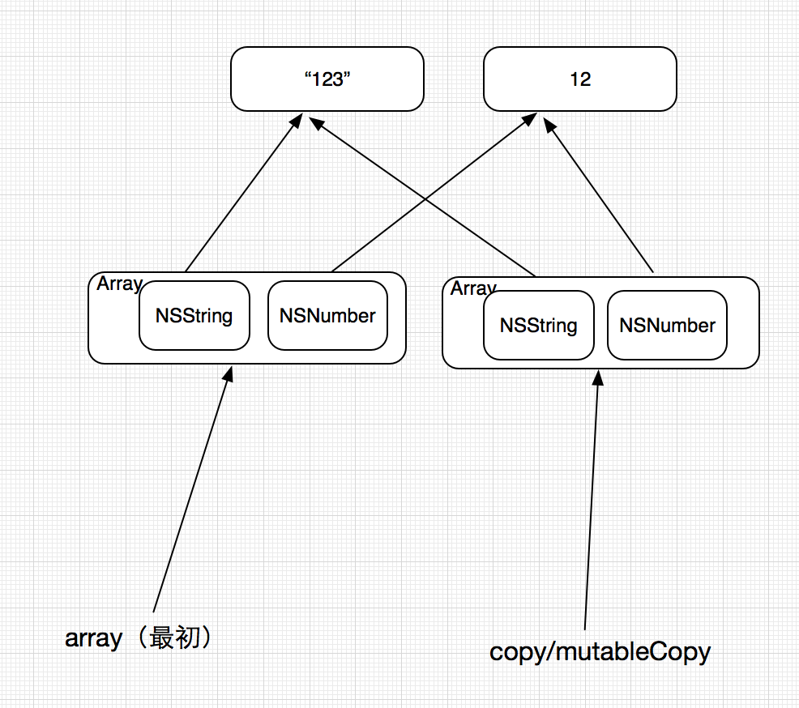

# Swift 值类型,引用类型,深拷贝,浅拷贝,Copy,MutableCopy

> 前言：Swift相对应Objective C来说，它不再需要绝大部分对象继承自`NSObject`,所以Swift的类型和Objective C的变量类型也不一致。

## Value Type/Reference Type

什么是值类型，引用类型？

二者最主要的差别在于当copy发生的时候，注意，当在Swift中使用赋值符号的时候发生的都是copy，这个在最后我会解释为什么。

Struct是值类型

```
struct S{
    var num = -1
}
var a = S()
var b = a
a.num = 10
print(b.num) //-1
```

可以看到，值类型拷贝后的内存是这个样子的


再来看看引用类型

```
class S{
    var num = -1
}
var a = S()
var b = a
a.num = 10
print(b.num) // 10

```



总结

> 值类型或者引用类型在赋值的时候都是Copy，值类型拷贝累实际的内存（value），而饮用类型只是拷贝了指针，仍然指向最开始的内存区域

## 什么是值类型or 引用类型？

* Class的实例是引用类型
* Swift方法类型是引用类型（在Swift中，方法也是一种类型）
* 其余的都是值类型，像Array，Dictionary本质都是Struct。

## 值类型的优点

> 优点还是很明显的，每次得到的都是一个Copy，这样就可以放心的运行，没必要担心其他代码修改这个值。尤其是在多线程环境里。

值类型每次都会进行Copy吗？

> 并不是每次都是要copy的，当值并不会改变的时候，Swift并不会进行copy。例如`let a = 1;let b = a`.

## 什么时候用值类型/引用类型？

用值类型

* 当你希望用`==`来比较的时候
* 赋值后有独立的状态
* 数据在多线程中使用

引用类型

* 当你希望用`===`来比较的时候（注意，这里三个等号）
* 创建共享的可变数据

## Copy/MutableCopy

对于不可变类型，举例NSString
代码

```
   let str1 = NSString(string: "123")
   let str2 = str1.copy() as!  NSString
   let str3 = str1.mutableCopy() as! NSMutableString
   NSLog("最初: %p", str1)
   NSLog("copy: %p", str2)
   NSLog("mutableCopy: %p", str3)
```

可以看到Log

```
2015-12-01 12:07:41.861 SWTest[1082:40543] 最初: 0x7fd1d3d74cb0
2015-12-01 12:07:41.862 SWTest[1082:40543] copy: 0x7fd1d3d74cb0
2015-12-01 12:07:41.862 SWTest[1082:40543] mutableCopy: 0x7fd1d3d18c80
```

可以看到，对于不可变类型

* copy 是浅拷贝，只拷贝指针
* mutableCopy 是深拷贝，拷贝了value

对于可变类型，举例NSMutableString

```
  let str1 = NSMutableString(string: "123")
  let str2 = str1.copy() as!  NSString
  let str3 = str1.mutableCopy() as! NSMutableString
  NSLog("最初: %p", str1)
  NSLog("copy: %p", str2)
  NSLog("mutableCopy: %p", str3)
```

可以看到Log

```
2015-12-01 12:10:35.721 SWTest[1113:43822] 最初: 0x7fba89e8a850
2015-12-01 12:10:35.721 SWTest[1113:43822] copy: 0xa000000003332313
2015-12-01 12:10:38.006 SWTest[1113:43822] mutableCopy: 0x7fba89e8a960
```

可以看到，对于可变类型

* copy 深拷贝，拷贝了value
* mutableCopy 是深拷贝，拷贝了value

对于不可变集合
线写一个辅助方法，打印NSArray中对象指向的地址

```
    func logArrayElementPointAdderss(array:NSArray,description:String){
        for element in array{
            let object = element as! NSObject
            NSLog("%@: %p", description,object)
        }
    }
```

然后

```
  let array = NSArray(arrayLiteral: NSString(string: "123"),NSNumber(int: 12))
        let array1 = array.copy() as!  NSArray
        let array2 = array.mutableCopy() as! NSMutableArray
        NSLog("最初: %p", array)
        NSLog("copy: %p", array1)
        NSLog("mutableCopy: %p", array2)

        logArrayElementPointAdderss(array, description: "最初")
        logArrayElementPointAdderss(array1, description: "copy后")
        logArrayElementPointAdderss(array2, description: "mutableCopy后")
```

看看Log

```
2015-12-01 12:18:46.252 SWTest[1156:50909] 最初: 0x7f9c304afcb0
2015-12-01 12:18:46.253 SWTest[1156:50909] copy: 0x7f9c304afcb0
2015-12-01 12:18:46.253 SWTest[1156:50909] mutableCopy: 0x7f9c30403980
2015-12-01 12:18:46.255 SWTest[1156:50909] 最初: 0x7f9c304b4d30
2015-12-01 12:18:46.255 SWTest[1156:50909] 最初: 0xb0000000000000c2
2015-12-01 12:18:46.255 SWTest[1156:50909] copy后: 0x7f9c304b4d30
2015-12-01 12:18:46.256 SWTest[1156:50909] copy后: 0xb0000000000000c2
2015-12-01 12:18:46.256 SWTest[1156:50909] mutableCopy后: 0x7f9c304b4d30
2015-12-01 12:18:46.256 SWTest[1156:50909] mutableCopy后: 0xb0000000000000c2
```

可以看到，对于不可变集合

* 对于集合本身，Copy只是拷贝了指针，指针仍然指向最初的Array对象
* 对于集合本身，MutableCopy拷贝了value
* 对于集合中存储的对象，不管是copy还是mutableCopy，都是浅拷贝。

画个图加深理解
对于NSArray的Copy


对于NSArray的MutableCopy



对于可变集合

```
    let array = NSMutableArray(arrayLiteral: NSString(string: "123"),NSNumber(int: 12))
        let array1 = array.copy() as!  NSArray
        let array2 = array.mutableCopy() as! NSMutableArray
        NSLog("最初: %p", array)
        NSLog("copy: %p", array1)
        NSLog("mutableCopy: %p", array2)

        logArrayElementPointAdderss(array, description: "最初")
        logArrayElementPointAdderss(array1, description: "copy后")
        logArrayElementPointAdderss(array2, description: "mutableCopy后")
```

可以看到Log

```
2015-12-01 12:31:22.818 SWTest[1209:61916] 最初: 0x7f937ad73d90
2015-12-01 12:31:22.818 SWTest[1209:61916] copy: 0x7f937ad91fb0
2015-12-01 12:31:22.819 SWTest[1209:61916] mutableCopy: 0x7f937ad73190
2015-12-01 12:31:22.819 SWTest[1209:61916] 最初: 0x7f937ac0c100
2015-12-01 12:31:22.820 SWTest[1209:61916] 最初: 0xb0000000000000c2
2015-12-01 12:31:22.820 SWTest[1209:61916] copy后: 0x7f937ac0c100
2015-12-01 12:31:22.820 SWTest[1209:61916] copy后: 0xb0000000000000c2
2015-12-01 12:31:22.820 SWTest[1209:61916] mutableCopy后: 0x7f937ac0c100
2015-12-01 12:31:22.820 SWTest[1209:61916] mutableCopy后: 0xb0000000000000c2
```

可以看到，对于可变集合

* 对于集合本身，Copy拷贝了value
* 对于集合本身，MutableCopy拷贝了value
* 对于集合中存储的对象，不管是copy还是mutableCopy，都是浅拷贝



